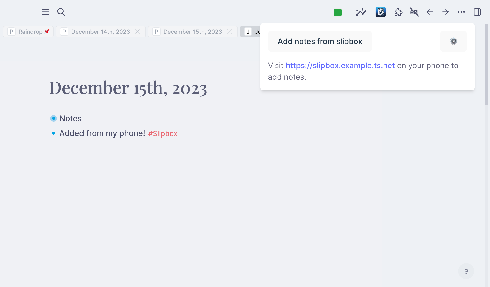

# slipbox

A plugin & self-hosted server for writing notes on-the-go, and saving them to Logseq later.
Requires Tailscale.

<p align="center">
  <picture style="max-width: 800px">
    <source media="(prefers-color-scheme: dark)" srcset="./assets/screenshots/plugin_dark.png">
    
  </picture>
</p>

## Setup

You'll need to set up the Docker container to run the slipbox server, and add the plugin to Logseq.

For the server, deploy the docker container, add it to your Tailscale net, and you're good to go!

### 1. Download the container

```fish
docker pull ghcr.io/phildenhoff/logseq-slipbox:main
```

### 2. Run the container

Our container needs a permenant storage location to store the database and config files, which we'll say is /path/to/your/config for now.
This can also be a Docker volume, but that slightly complicates things.

Within the config folder, you MUST create two folders: `tailscale` and `app`.
The server will not start without these folders.

```fish
cd /path/to/your/config
mkdir tailscale app

docker run \
  # optional, required if you're on an M1 Mac
  --platform linux/amd64\
  --name=slipbox \
  -v /path/to/your/config:/data \
  ghcr.io/phildenhoff/logseq-slipbox:main
```

### 3. Add the server to your Tailscale network

Open the container's logs. At the bottom, you'll see a prompt asking you to
go to the Tailscale website to authenticate the server.

```text

To authenticate, visit:

        https://login.tailscale.com/a/<uuid>

```

Click the link, and add the server to your network.
You should see a success page. Once you do, you can close the browser tab; slipbox is now ready to use!

If you've set up Magic DNS, you can now go to `https://slipbox.<your tailnet>.ts.net` to access the server.
This is the domain name you'll use on your phone and in the plugin during setup.

### 4. Add the plugin to Logseq

Download the latest `slipbox.zip` release from the [releases page](https://github.com/phildenhoff/logseq-slipbox/releases).

Extract the zip file and copy the `slipbox` folder to your Logseq plugins folder — that's something like `$USER/.logseq/plugins`.

Reload Logseq, and you should have a new Slipbox icon in the Plugins menu.

## Development

### Server (`proxy`)

You must have Taiscale installed and running on your machine.

First, run the server using Deno, with required permissions. The final argument is the location of your SQLite database.

```fish
cd apps/proxy
deno run --allow-read --allow-write --allow-net main.ts slipbox.db
```

This will start the server on port 61230, **but it will not be accessible yet**.
`proxy` requires all requests to be authenticated by Tailscale, so we need to setup Tailscale to send requests to the dev server, using [`tailscale serve`](https://tailscale.com/kb/1242/tailscale-serve).

Then, we'll be able to access our server by visiting `https://<your-device>.<your-tailnet>.ts.net`.

```fish
tailscale serve 127.0.0.1:61230
```
